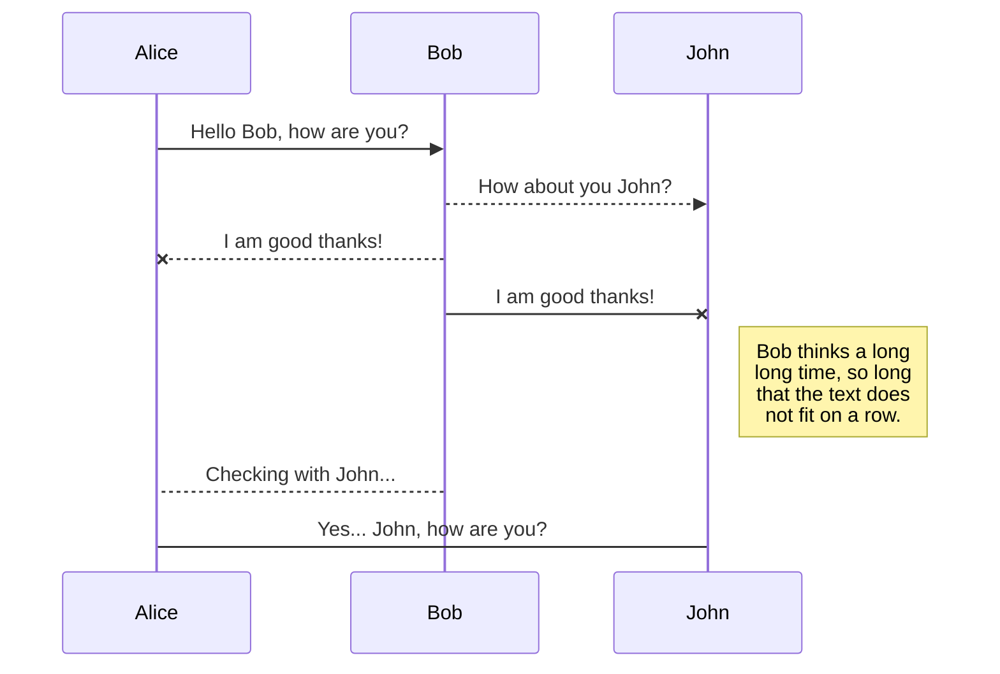
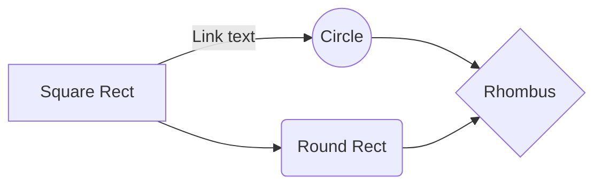

# Azadeh Gilanpour - Project2- Summarization

Millions of documents are push onto the Internet every year. Hundreds of thousands of those documents are academic documents that may be meaningful. Unfortunately, no human is able to wade through the gruff to reach the meaningful documents. Most scientist only look at documents that are published at “prestigious” journals and conferences. In this project, you are going to exercise what you have learned so far in class to help scientists and interested citizes get a lay of the land when it comes to publlished academic work.

In this project, we will cooperate with classmates to summarize as much of the corona virus literature as possible. 
We want to help scientists and interested citizes get a lay of the land when it comes to publlished academic work. 

So we need to do:
1.  Select a subset of academic documents.
2.  Tokenize and cluster the documents.
3.  Summarize each cluster.

We will use a data set available from the Allen Institute for AI through Kaggle. https://www.kaggle.com/allen-institute-for-ai/CORD-19-research-challenge . You may need to register and get a Kaggle account to access the data.

# Six step below exlpain each job was done for this project:

All step was done in the jupyter notebook, and exh part I will explain the function and runnig style.

## 1. Explore the data set and look at the format of the files.
Our first task in this project is exploring the json_schema.txt file to identify the important field that we would need to extract from our Json file for clustering and summarizing the document. We can open it this file by blow code:
    

 - f = open ("CORD-19-research-challenge/json_schema.txt", 'r')
 - f.readlines()
 - f.close()

After Runnig that you will see  the schema text file of the Json data  that :
<![endif]-->

**“paper_ id”**: which string and doesn’t have any meaning to help us to use.

**“metadata”** that contain :
 

 - **“title”:**  which is the string and it might be good for using.
 - **“authors**”: this one is a list of dictionary contain the information about authors such as first/last name,    email…. That I don’t think it would important for us in this project
 - **“abstract”**: this one also is a list of dictionary contain the:

  -  -  -**“text”,** string that might be helpful for us in this project”

 -  - **cite_spabs”** is list of dictionary that contain the position of the where the cations are.

 -  - **”ref_spans”,** as explain in the text it is the same as “cite_span” it is a list of dictionary
 -  - **” section”:** this part contains abstract text
 - **“body text”:** this part is a list of dictionary contain the:

 -  - **“text”** which is string and conation text body of paper which it is important in our project.

 -  - **cite_spabs”** it is list of dictionary that contain the cations

 -  - ,”**ref_spans”,**” it is a list dictionary
 -  - **“section”**

 -  - **“introduction”** it is string contain introduction of the paper

 -  - **“conclusion”** it is string contain conclusion of the paper

 - **bib entries”** which contain different BIBREF which that one also contains different string, list dictionary, integer about the information of the people and paper that cite in the citations that I think it is not important in our project.

 - **"ref_entries”**: which contain different "FIGREF" and "TABREF” which contain string that explain the caption of the figure and table and figure and table as well.

 - **"back matter"** this one is the same as “body_text” as explain in the text that contain list of dictionary

All your files and folders are presented as a tree in the file explorer. You can switch from one to another by clicking a file in the tree.

## 2. Write a function to choose a set of documents in the data set, randomly choose 10 percent of the total files.
For this part I make a function which first I used **glob** method to get access to the file we have to download it and unzip it from Kaggle website to get all *45941* files.
Then I used **np.random.choice** to get the 10 present of the that 4*5941* file which would be 4*594*

## 3.  Write a file reader a file and tokenize the data.

In this part we need to call a a function that take a 10 percent of the data and then tokenize it. Because the data format is Json we need to open our files and then call the Json.load methods for opening our Json file.  Which I opened mine with enumerate . Also because I got getting error *“ expected str, bytes or os.PathLike object, not tuple* ”  after googling I add one **(i)** to my enumerate to fix it.  Then I decided to have a better view of my dataset in form of DataFrame. I choose three columns from my Json file that I thought it might be helpful for this project, which are **“title”**,**”text” from “abstract** and “**text” from “body_text”**. Beacuse each documents have different paragraphs and we need combine each paragraph which I read an empty list and append the “abstract” and “body_text” ‘s text to their empty list. At the end I add all of them to my DataFrame tuples.

I saved the result of this reader function in df, and in rest of the code instead of calling the function I am working with this df.

The second job of this part was Tokenizing, which first I decided to make a function that I called (normalize) for consider everything that I can make the text cleaner and make it ready for tokenizing.  I used some of them from internet and lectures and some of them that I saw they repeated a lot in text by myself. After that I use word tokenizing and WordNetLemmatize. In my word tokenize function I called (nomalize ) function  to consider cleaning on it. I tried sent tokenizing as well but I couldn't find any differences so I decided to go with word to tokenizng.

## 4.  Write a function to take tokenized data and add it to the clustering method of your choice.
After tokenizing our data, we need to convert it into a format that would be ready for do clustering. Based on the lecture explaining first we need to use **np.vectorize** to convert it to vector and then we need to take a list of items . In this part I totally follow The professor way and called it even in the same name. (norm_corpus) is the one that get the list of the item in the vector style. Then I check the length of that which was correct (4594). After that used TFIDF vectorising this also will convert our string formatted data into a measure of how important each word is to the instance out of the literature as a whole. Vectorising our data. We will be clustering based off the content of the body text. I used the k- menas clustring for clustring and used Elbow method to find the number of the clustring. The code is not wrote by me I used it from interent and cite it in this project. 
This method use **PCA** to reduce the size of the array and then use cdit to find the special distant and run with different number of k as number of the clustring. I tried range of (1,50) . 

![](data:image/png;base64,iVBORw0KGgoAAAANSUhEUgAAAYsAAAEWCAYAAACXGLsWAAAABHNCSVQICAgIfAhkiAAAAAlwSFlzAAALEgAACxIB0t1+/AAAADh0RVh0U29mdHdhcmUAbWF0cGxvdGxpYiB2ZXJzaW9uMy4xLjEsIGh0dHA6Ly9tYXRwbG90bGliLm9yZy8QZhcZAAAgAElEQVR4nO3dd5gUVdbA4d9hyCCShoyEFXUGkOCIGAiCAmZUdE2fqLgYMOOKYQ2YVl1zYg2o6JozZlgjJnBQJKogBkCSEpUM5/vjVC/NODPdM0x3dTjv89TT3berq05N9/TpuvfWvaKqOOecc6WpFHYAzjnnUp8nC+ecczF5snDOOReTJwvnnHMxebJwzjkXkycL55xzMXmySAMico2I/CcJ+2ktIioilYPHH4jI6YnebzJU5LGIyGMicn05XqcisnNFxFDC9nuIyLeJ2n4x+0vo8ZSXiFwuIg8naNs/isgBJTxXrs9FuvBkkQJE5PeoZYuIrI16fGIF7+sxEdlQZJ9fV+Q+yisqWX1ZpLxhEPOPcW4nKck11ajqBFXdNRHbTtUfDiLSW0TmR5ep6o2qmnKxpjtPFilAVWtHFuBn4LCosicTsMtbovepqp0SsI/tUUtEOkQ9PgH4IaxgnHOeLNJJVRF5XERWi8gMESmIPCEizUTkRRFZKiI/iMh5Fbjfv4jIJBFZKSKvikj9qP0eHsSyIvjlmReUnyoir0WtN0dEnot6PE9EOpeyzyeAwVGPTwYej16hpGMWkQHA5cBfizlraiUinwR/w3Ei0jDWsQTPdRGRL4PXPQtULylwEdlZRD4M/l6/ButHO0BEZovIchG5T0QkeF0lEfmHiPwkIkuC93rH4LkxIjI8uN88OPs6O2p/y8Rs8ys7qDK5WESmBvE8KyLVo56/REQWisgvInJ6SdVKInID0AO4N/ib3hvreILXnSYis4Ln3hGRVqX83Ur7+/8oIpeJyMxgW4+KSHURqQW8BTSTrWfJzaLPLGXr2eqpweduuYicKSJ7Bn+XFdHHIyJ/EZH3ROS34P17UkTqlhR3Kcezg4i8LyJ3R/9N0pqq+pJCC/AjcECRsmuAdcDBQA7wT+Dz4LlKwGTgKqAq0BaYC/QvYfuPAdeX8FxrQIHKweMPgAVAB6AW8CLwn+C5XYA/gAOBKsAlwJyoGFYEsTUFfgIWBK9rCywHKpWy/9bAvOBY84BvgQOAH+M55uDv9Z8i2/4A+D6Iu0bw+KY4jqVqEP+FwXODgI2l/A2fBq4IYqwO7Bf1nAKvA3WBnYClwIDgudOCfbYFagMvAU9EPfdacP+E4DiejXru1eB+b2B+kc/SJKAZUB+YBZwZPDcAWAS0B2piCVqBnUs4rg+A04uUlXY8A4PjyQMqA/8APi1h2yX+/aOOYzrQMjiOTyJ//6LHXPT9Z+tn6t/B+9EP+196BWgENAeWAL2C9XcO4qgG5AIfAXeW9v9Z9H8LaBD83Yv9jKTr4mcW6eNjVX1TVTdj/9iRqqM9gVxVvVZVN6jqXOAh4LhStnVx8IsqsowpZd0nVHW6qv4BXAkcKyI5wF+BN1R1vKpuBG7FvoT3CWJYDXQGegHvAAtEZLfg8QRV3VLKPuezNUEMpshZRTmPGeBRVf1OVdcCzwXxUdqxAN2xL7A7VXWjqr4AfFHKPjYCrYBmqrpOVT8u8vxNqrpCVX8G3o+K4UTgdlWdq6q/A5cBx4l1NvgQ6CEilYCewC3AvsHregXPl+RuVf1FVZcBr0Xt79jg7zFDVdcAI0vZRmlKOp4zgH+q6ixV3QTcCHQu4eyitL9/xL2qOi84jhuA48sY53XB+zEOS0xPq+oSVV0ATAC6AKjqnCCO9aq6FLgd+xvHqxn2fjyvqv8oY4wpzZNF+lgUdX8NUD34ImmFnYb/78sfq4ZpXMq2blXVulHL4FLWnRd1/yfsi7Mh9k/xU+SJ4Mt/HvZLDewfpjf25fYh9su0F7G/3CIeB07BvhSKNlaX55jhz3/D2sH90o6lGXZWFD3i5k+U7BJAgElBtcpp5YkhuF8ZaKyq3wO/Y1/EPbBf87+IyK7E/nuWtr/o9zb6flmUtP1WwF1R788y7O/SnD+L9VkqGt9PwWvKYnHU/bXFPK4NICKNROQZEVkgIquwz15D4ncIluj+Xcb4Up4ni/Q3D/ihyJf/Dqp6cAVtv2XU/Z2wX86/Ar9gXwgABPWyLbFqK9iaLHoE9z+kbMniRewfb66qFv1yjnXMZR1KubRjWQg0L1LvvFNJG1LVRar6N1Vthv26vr+4doBYMQT72MTWL7UPsSqwqsGv4Q+xtpx6wJQ4tl/UQqBF1OOWJa0YKOvfdB5wRpH3qIaqflrMurE+S0Xj2yl4TXniiuWfwTZ3V9U6wElYkovXQ8DbwJtBm0rG8GSR/iYBq0RkhIjUEJEcEekgIntW0PZPEpF8EakJXAu8EFSFPQccIiJ9RaQKMBxYD0S+DD4E9gdqqOp87FR/AFaf+1WsnQbVXn2A4rpAxjrmxUDroNomHqUdy2fYl/Z5IlJZRI4CupW0IRE5RkQiX8LLsS+ezXHE8DRwoYi0EZHaWLXNs0EVDtjf8xysDh3sTO1crHoynu0X9RxwqojkBe/tVTHWX4y1p8Tr38BlItIeQER2FJFjSomltM8SwDARaSHWweJyINJxYDHQQILOABVgB+wsboWINAf+Xo5tnINVo74uIjUqKK7QebJIc8EXxWFYFcUP2K/+h4HS/nkukW2vs/i1lHWfwBruFmENhOcF+/0W+9V1T7DPw7AuvxuC57/D/ukmBI9XYY3Qn8T75aaqhUEVTFmP+fng9jcpcs1GCfsp8ViC4zkKqxJbjtWvv1TK5vYEJorI78BY4HxVjafb7yPY3/qj4JjWYckg4kPsiyySLD7GGqY/ohxU9S3gbqydYQ6WFMG+pItzFzAo6E10dxzbfxm4GXgmqM6ZDhxUwrqlfpYCTwHjsM/QXKwhGVX9Bku0c4Mqr7JWTxU1EugKrATeoPT3ulhBleVQ7OzqVYnqgZbOZNuqWOdcNgq6qk4HqkWdzaQEsYsxT1fV/4YdSzbzMwvnspSIHCkiVUWkHnYW8FqqJQqXOjxZOJe9zsCujfgea1c5K9xwXCrzaijnnHMx+ZmFc865mCqHHUAiNGzYUFu3bh12GM45l1YmT578q6rmFvdcRiaL1q1bU1hYGHYYzjmXVkSkxNEJvBrKOedcTJ4snHPOxeTJwjnnXEyeLJxzzsXkycI551xMniycc87FlLBkEcyRO0lEvg4mgRkZlD8mNmfylGDpHJRLMF/tnGBu3K5R2xosNs/vbBEpbaIe55xzCZDIM4v1QB9V7YQNJT1ARLoHz/1dVTsHS2TiloOAdsEyFBgFEIxffzWwFzaPwNXBwGcVbsVy5dN9/87UF75LxOadcy5tJSxZqPk9eFglWEobiOoI4PHgdZ8DdUWkKdAfGK+qy1R1OTAem0SnwlX6fjZ5nz5M3vGd4JZbYJMPwOmcc5DgNotgBrMpwBLsC39i8NQNQVXTHSJSLShrzrbz7M4PykoqL7qvoSJSKCKFS5cuLVe8dQp2oXvtGcxsOQBGjIC99oKvvy7XtpxzLpMkNFmo6mZV7YzN9dtNRDoAlwG7YTOK1QdGBKsXN8+tllJedF8PqmqBqhbk5hY7tElcqrVpxj/yX4Lnn4f586GgAK68EtaXNIGYc85lvqT0hlLVFdicwQNUdWFQ1bQeeJSt8xnPZ9tJ2Vtgk7KXVJ4QrVvDTz8LDBoEM2fCCSfA9ddD587waXFzzTvnXOZLZG+oXBGpG9yvARwAfBO0QyAiAgzEpnIEm6/45KBXVHdgpaouBN4B+olIvaBhu19QlhCtWsFPkaG0GjSAMWPgrbdgzRrYbz84/3z4/fdSt+Gcc5kmkWcWTYH3RWQq8AXWZvE68KSITAOmAQ0JJl4H3sQmYp8DPAScDaCqy4Drgm18AVwblCVEq1awahWsWBFVOGAATJ8OZ58Nd98NHTvC+PGJCsE551JORs6UV1BQoOUdovz55+HYY2HKFOjUqZgVJkyA00+H776DU0+F226Degnpyeucc0klIpNVtaC45/wK7iJatbLbn0oa1b1HD+shddll8PjjkJ8PL7+ctPiccy4MniyKiJksAKpXhxtvhEmToEkTOOooOOYYWLQoKTE651yyebIoolEjywWlJouIrl0tYdx4I7z2mp1ljBkDGVi155zLbp4sihCBnXaKM1kAVKliVVJTpkBeHpxyChx0UBk24Jxzqc+TRTG26T4br912s8bve+6Bjz+G9u3h3nthy5aExOicc8nkyaIY5UoWAJUqwTnnwIwZdk3GuedCz57w7bcVHqNzziWTJ4titGoFS5bA2rXbsYG33oLHHrOrwDt1gn/+EzZurMgwnXMuaTxZFCPSI+rnn7djIyIweLAli8MOg8svh27d4KuvKiRG55xLJk8WxYir+2y8mjSxK/1efBEWLoQ997QG8XXrKmDjzjmXHJ4sitG6td1WaIemo46CWbPg5JPhppusaurjjytwB845lzieLIrRrBnk5CSg92u9evDII/DOOzbkeY8e1iC+enUF78g55yqWJ4tiVK4MLVok8FKJfv1sYMLzzoP774cOHSyBOOdcivJkUYJyd5+NV+3acNddVhVVs6aNbDt4MPz2WwJ36pxz5ePJogQJTxYR++xjPaSuuAKeesqGDHnhBR8yxDmXUjxZlKBVK1iwADZtSsLOqle32fi++MLqv445Bo4+2npPOedcCvBkUYJWrWDzZksYSdO5M0ycaL2l3nzTzjIefdTPMpxzofNkUYIKvdaiLCpXhhEjYOpUm5HvtNOsQfyHH5IciHPObeXJogShJYuIXXaBDz6w3lKff249pu6+2053nHMuyTxZlGCnnew21B/0lSrBWWfZwIS9esH559u1GTNnhhiUcy4bJSxZiEh1EZkkIl+LyAwRGRmUtxGRiSIyW0SeFZGqQXm14PGc4PnWUdu6LCj/VkT6JyrmaNWr26jjkyYlY28x7LQTvPEGPPGEjWDbpYs1iPvAhM65JEnkmcV6oI+qdgI6AwNEpDtwM3CHqrYDlgNDgvWHAMtVdWfgjmA9RCQfOA5oDwwA7heRnATG/T89e9oUFSlR8yMCJ51kQ4YMHAhXXgkFBTB5ctiROeeyQMKShZrfg4dVgkWBPsALQfkYYGBw/4jgMcHzfUVEgvJnVHW9qv4AzAG6JSruaL16wapV1tacMho1gmefhZdfhqVLbSTbESO2Yzx155yLLaFtFiKSIyJTgCXAeOB7YIWqRq5emA80D+43B+YBBM+vBBpElxfzmoTq2dNuP/wwGXsro4EDre3itNPglltsYMKPPgo7KudchkposlDVzaraGWiBnQ3kFbdacCslPFdS+TZEZKiIFIpI4dKlS8sb8jZatIC2bVM0WQDUrQsPPQT//a9dPdirF5x9tp0OOedcBUpKbyhVXQF8AHQH6opI5eCpFsAvwf35QEuA4PkdgWXR5cW8JnofD6pqgaoW5ObmVljsvXrZD/aUnkq7b1+YNg0uvBD+/W+b//vNN8OOyjmXQRLZGypXROoG92sABwCzgPeBQcFqg4FXg/tjg8cEz7+nqhqUHxf0lmoDtAOS1kepZ09YtiwNeqvWqgW33w6ffgp16sAhh1iD+K+/hh2Zcy4DJPLMoinwvohMBb4Axqvq68AI4CIRmYO1SYwO1h8NNAjKLwIuBVDVGcBzwEzgbWCYqiatf1KvXnabslVRRXXvDl9+CVddZQ3h+fl260OGOOe2g2gGfokUFBRoYWFhhWxL1a7m7t4dnnuuQjaZPFOnwpAhUFgIhx8Oo0bZzE7OOVcMEZmsqgXFPedXcMcgYlVRH32Uhj/Od98dPvsMbr0Vxo2zs4yHH07DA3HOhc2TRRx69YLFi+G778KOpBwqV4bhw60BvHNn+Nvf4IAD4Pvvw47MOZdGPFnEIe3aLYqz887w3nvwwAM2b0bHjtYgnhKXpzvnUp0nizi0awe5uTb4a1qrVAmGDrWuXX362BnHPvvYfODOOVcKTxZxELEL9JYsCTuSCtKiBbz2mk3jOncudO0KI0fChg1hR+acS1GeLOLUoAH89lvYUVQgETj+eDvLOOYYuOYa2GMPq6JyzrkiPFnEKeOSRURuLjz5JIwdC8uXWx/hiy+GNWvCjsw5l0I8WcSpfv0MTRYRhx1mkyz97W9w223W7fb998OOyjmXIjxZxKlBA/vhndJjRG2vHXe0saXee88e9+kDZ5wBK1eGG5dzLnSeLOLUoIFdy7ZiRdiRJMH++9vV3xdfbBfx5edbg7hzLmt5sohTgwZ2m9FVUdFq1oR//cv6CzdoYMOFnHCCTbjknMs6nizilHXJImLPPW1sqZEj4YUXIC/Putz6kCHOZRVPFnHK2mQBULWqjWL71Vd2JfiJJ9qZxvz5YUfmnEsSTxZxql/fbpctCzeOULVvD598YsOEvPuutWU88ECGt/o758CTRdyy+swiWk6Ozcg3fbpVUZ15pvWamj077MiccwnkySJOdeva0EpZnywi2ra1ub8fesiqp3bf3YZC37Qp7MiccwngySJOlSpBvXqeLLYhAqefbkOG9OsHf/877L23dbt1zmUUTxZlkLFDfmyv5s3hlVds+taffrIxpq6+GtavDzsy51wF8WRRBhk/5Mf2EIFjj4VZs+C44+Daa20027Qf1905B54syqRBgyzvDRWPBg3giSfgjTdg1SqbL+Oii+CPP8KOzDm3HRKWLESkpYi8LyKzRGSGiJwflF8jIgtEZEqwHBz1mstEZI6IfCsi/aPKBwRlc0Tk0kTFHItXQ5XBwQfbwIRnngl33GEz8737bthROefKKZFnFpuA4aqaB3QHholIfvDcHaraOVjeBAieOw5oDwwA7heRHBHJAe4DDgLygeOjtpNUnizKqE4duP9+m4+2cmWb+/v007NkgC3nMkvCkoWqLlTVL4P7q4FZQPNSXnIE8IyqrlfVH4A5QLdgmaOqc1V1A/BMsG7SNWhgtSnebltGPXvC11/DiBHw2GN2Md+rr4YdlXOuDJLSZiEirYEuwMSg6BwRmSoij4hIvaCsOTAv6mXzg7KSyovuY6iIFIpI4dIEDXbnF+Zthxo14KabYOJEaNQIBg6Ev/4VFi8OOzLnXBwSnixEpDbwInCBqq4CRgF/AToDC4HbIqsW83ItpXzbAtUHVbVAVQtyc3MrJPaiIkN+eLLYDpGpW6+/3rrb5udbg7gPTOhcSktoshCRKliieFJVXwJQ1cWqullVtwAPYdVMYGcMLaNe3gL4pZTypIucWXiPqO1UpQpccQVMmQK77gonnwyHHAI//xx2ZM65EiSyN5QAo4FZqnp7VHnTqNWOBKYH98cCx4lINRFpA7QDJgFfAO1EpI2IVMUawccmKu7SeDVUBcvLgwkT4K67rBG8fXtrEPeBCZ1LOYk8s9gX+D+gT5FusreIyDQRmQrsD1wIoKozgOeAmcDbwLDgDGQTcA7wDtZI/lywbtJ5skiAnBw47zwbmHDvvWHYMOjdG777LuzInHNRKidqw6r6McW3N7xZymtuAG4opvzN0l6XLJ4sEqhNG3jnHRgzxka13X13m3Bp+HDrduucC5VfwV0GNWtC9eqeLBJGBE45xQYmPPhguPRS2Gsv63brnAuVJ4syql/fG7gTrmlTeOklm8Z1wQIoKIB//APWrQs7MueylieLMvKruJPo6KPtLOPEE+GGG6BLF/j007Cjci4rebIoI08WSVa/vl31/fbbsGYN7LefNYj//nvYkTmXVTxZlJEni5D07289poYNg3vvhQ4dYNy4sKNyLmt4sigjTxYh2mEHuOce+Ogj62nQvz+ceiosXx52ZM5lPE8WZRRp4PbRKUK033529fdll9lQIfn51iDunEsYTxZl1KABbNoEq1eHHUmWq14dbrzRxplq0sQawwcNgkWLwo7MuYzkyaKM/MK8FNOlC0yaZInj9dftLOOxx/zUz7kK5smijDxZpKAqVaxKasoUSxanngoDBsCPP4YdmXMZw5NFGXmySGG77WaN3/fea9djdOhgDeI+MKFz282TRRl5skhxlSpZ99rp07dek9GzJ3zzTdiROZfWPFmUUWQCJB/yI8W1agVvvWUDE86cCZ06WbvGxo1hR+ZcWoo7WYhIjog0E5GdIksiA0tVPlteGhGxiZVmzYLDD7cJl7p1gy+/DDsy59JOXMlCRM4FFgPjgTeC5fUExpWyKleGHXf0ZJFWGjeG55+HF1+0rrXdulmD+Nq1YUfmXNqI98zifGBXVW2vqh2DZfdEBpbK/CruNHXUUVYlNXgw3HQTdO4MH38cdlTOpYV4k8U8YGUiA0knDRrAr7+GHYUrl3r1YPRoGD8eNmyAHj3gnHP8KkvnYog3WcwFPhCRy0TkosiSyMBSWZs2MGdO2FG47XLAATBtGpx/vs373aGDjWzrnCtWvMniZ6y9oiqwQ9SSlfLy4IcfvMo77dWuDXfeCZ98ArVqwUEHWRWV1zE69ydxTW6sqiMBRGQHe6hZPZlAXp6NJjF7tk0V7dLc3nvDV1/B9ddbW8bbb9uFfYMGWY8q51zcvaE6iMhXwHRghohMFpH2MV7TUkTeF5FZIjJDRM4PyuuLyHgRmR3c1gvKRUTuFpE5IjJVRLpGbWtwsP5sERlc/sOtGLvtZrezZoUbh6tA1arBdddBYSG0bAnHHmsN4gsXhh2Zcykh3mqoB4GLVLWVqrYChgMPxXjNJmC4quYB3YFhIpIPXAq8q6rtgHeDxwAHAe2CZSgwCiy5AFcDewHdgKsjCSYsu+xiPzg9WWSgTp3g88/hllvsDCMvDx55xAcmdFkv3mRRS1XfjzxQ1Q+AWqW9QFUXquqXwf3VwCygOXAEMCZYbQwwMLh/BPC4ms+BuiLSFOgPjFfVZaq6HGs7GRBn3AlRo4Y1cvsIEhmqcmX4+9/h668teQwZAv36WUOVc1kq7t5QInKliLQOln8Acf/niEhroAswEWisqgvBEgrQKFitOdZFN2J+UFZSedF9DBWRQhEpXLp0abyhlVtenp9ZZLxddoH334dRo2DiROsxddddsHlz2JE5l3TxJovTgFzgJeDl4P6p8bxQRGoDLwIXqOqq0lYtpkxLKd+2QPVBVS1Q1YLc3Nx4QtsueXnw7bf+vZHxKlWCM8+EGTOgVy+44AIboHDmzLAjcy6p4koWqrpcVc9T1a6q2kVVzw+qhEolIlWwRPGkqkbmvVwcVC8R3C4JyucDLaNe3gL4pZTyUO22G6xf71MmZI2WLeGNN+A//7FucF26WIP4hg1hR+ZcUpSaLETkzuD2NREZW3SJ8VoBRgOzVPX2qKfGApEeTYOBV6PKTw56RXUHVgbVVO8A/USkXtCw3S8oC1Vent16u0UWEYETT7SziqOOgquugj33tB5UzmW4WNdZPBHc3lqObe8L/B8wTUSmBGWXAzcBz4nIEOxiv2OC594EDgbmAGsIqrlUdZmIXAd8Eax3raqGPkB4JFnMmgWHHBJuLC7JGjWCp5+G44+Hs86CvfaC4cNh5Ejr/eBcBhKNo0ugiJyvqnfFKksVBQUFWpiEX3tNmliiGD064btyqWrFCrjkEnjoIdh5Z3j4YWvbcC4NichkVS0o7rl4G7iLuxDulHJHlCF22817RGW9unXhwQfh3Xdt+tbeve1sY1VpfTmcSz+x2iyOF5HXgLZF2iveB7J+AJ28PGuz8Ou1HH36wNSpcNFFljzat7cGcecyRKwzi0+B27AL6m6LWoYT8oVxqSAvD5YvhyVLYq/rskCtWnDbbfDpp1CnDhx6KJx0ko9n7zJCqclCVX8CJgB/qOqHUcuXqropOSGmruhGbuf+Z6+9bOrWq6+G556zD8ozz/gpqEtrMdssVHUzsEZEdkxCPGnFk4UrUbVqcM01MHmyjQ1z/PEwcCAsWBB2ZM6VS7wN3OuwLrCjg5Fh7xaRuxMZWDpo3tymRPBrLVyJOnaEzz6DW2+12fny863nlJ9luDQTb7J4A7gS+AiYHLVkNRHvEeXikJNj12FMnQpdu8LQodC3L3z/fdiRORe3eIf7GAM8zdYk8VRQlvW6dIFJk2zoD+dKtfPO1sX2gQeseqpjR7j9dh9gzKWFeCc/6g3MBu4D7ge+E5GeCYwrbRx1FKxcCePGhR2JSwuVKtmZxYwZdnYxfDjssw9Mnx52ZM6VKt5qqNuAfqraS1V7YnNM3JG4sNJH377QoAE8+2zYkbi00qIFjB1rw4bMnWvVUyNH+sCELmXFmyyqqOq3kQeq+h1QJTEhpZcqVezs4tVXYe3asKNxaUUEjjvOGr2OOcZ6T+2xh9VrOpdi4k0WhUFPqN7B8hDewP0/xx4Lv/8Ob70VdiQuLTVsCE8+Ca+9Zld57r03XHwxrFkTdmTO/U+8yeIsYAZwHnA+MBM4I1FBpZvevSE316ui3HY69FBry/jb3+xK8I4dbaY+51JAvMniTFW9XVWPUtUjVfUOLIE4bMrmQYPg9dfhjz/CjsaltR13hH//25KEiI05NXSo9aJwLkQ+6mwF+etfrdbg9dfDjsRlhN697bqMv//dxsDPz7dqKudCEu+os22KjDr7AT7q7Db22w+aNvWqKFeBataEW26BiROty93hh9uwIUuXhh2Zy0Lxjjr7DduOOnsRPursNnJy4IQT4JVXfDIkV8EKCmzq1muvhRdftEHJnnrKhwxxSRVz1FlV/QA4AJigqh8CC4EWgCQ+vPRy3XXQvz+cfjrcc0/Y0biMUrUqXHklfPWVXQl+4olw2GEwb17YkbksEW+bxUdAdRFpDryLzY/9WKKCSlc1atiZxRFHwHnnwb/+FXZELuO0bw+ffAJ33GGN4O3bW4P4li1hR+YyXLzJQlR1DXAUcI+qHgnkl/oCkUdEZImITI8qu0ZEFojIlGA5OOq5y0Rkjoh8KyL9o8oHBGVzROTSsh1e8lWrBs8/D0ceCSNG+Lw3LgFycuCCC2DaNOjWzaZx7dMHZs8OOzKXweJOFiKyN3AiNgItQOUYr3mM4ts17lDVzsHyZrDxfOA4oH3wmvtFJEdEcrDxqA7CktPxwYpiEGYAABl/SURBVLoprUoV6+2oCjNnhh2Ny1ht29qw56NHw5QpsPvudjq7KevnJXMJEG+yuAC4DHhZVWeISFug1KuFVPUjYFmc2z8CeEZV16vqD8AcoFuwzFHVuaq6AXgmWDfl5QcpzZOFSygROO00+6D17w+XXGJXgE+dGnZkLsPEO0T5h6p6uKreHDyeq6rnlXOf54jI1KCaql5Q1hyIbqmbH5SVVP4nIjJURApFpHBpCnQtbNnSJkbyuS5cUjRrBi+/bNO4/vyzjTF11VU+dr6rMLGus7gzuH2tyHUWY0VkbDn2Nwr4C9AZ61V1W2RXxayrpZT/uVD1QVUtUNWC3NzccoRWsUSsh6OfWbikEbEBCWfOtOsxrrvORrP9/POwI3MZIFa7wxPB7a0VsTNVXRy5HwxGGLneeT7QMmrVFsAvwf2SylNeXh78979hR+GyToMG8PjjljDOOMPmyzj/fLj+eqhVK+zoXJqKdZ3F5OD2Q2zwwJlBldSHQVmZiEjTqIdHApGeUmOB40Skmoi0AdoBk4AvgHYi0kZEqmKN4OU5owlFfj788gusWBF2JC4rHXSQTap01llw553QoYP/enHlFqsaSoLurr9iV3F/JyJLReSqWBsWkaeBz4BdRWS+iAwBbhGRaSIyFdgfuBBAVWcAz2EJ6W1gmKpuVtVNwDnAO8As4Llg3bQQaeT2dgsXmjp14L774KOPrJvegQfCkCH+C8aVmWgpQwaIyIXAwcDQoJcSQU+oUcDbweizKaegoEALCwvDDoPvv7eLbUePtg4rzoVq7VobMuRf/4JGjeD++2HgwLCjcilERCarakFxz8XqDXUycHwkUYD1hAJOCp5zpWjdGqpX90ZulyJq1IB//tMGJmzUyK4cPfZYWLw49mtd1ouVLKqo6p+uQVbVpfi0qjHl5MCuu3qycClmjz3giy/ghhtsPuD8fHjiCR+Y0JUqVrIobfZ4n1k+Dvn5nixcCqpSBS6/3K783m03OPlkOPhgu0bDuWLEShadRGRVMctqoGMyAkx3+fnw0082R7dzKScvDyZMgLvvttv27a1B3AcmdEXE6jqbo6p1ill2UFWvhopDpEfUt9+GG4dzJapUCc4917rZ7r03nHMO9OrlH1q3jXjHhnLllJdnt14V5VJe69bwzjvw6KOWODp1gptu8oEJHeDJIuF23hkqV/Zk4dKECJxyil0cdMghcNllsNde1rbhsponiwSrUgV22cWThUszTZrYFK4vvAALFtjUrldcAevWhR2ZC4kniyTwHlEubR19tH14/+//4MYboXNnm6nPZR1PFkmQnw9z5/qPMpem6te3dox33rEPcY8eNm+wd/HLKp4skqBDB+uJOG1a2JE4tx369bOG73POgXvvtQ/2uHFhR+WSxJNFEvToYbcffBBqGM5tv9q1t16TUb26zc536qmwLN5JMV268mSRBE2aWBfa994LOxLnKsi++1oPqcsvt6FC8vOtQdxlLE8WSdKnj/0Y27gx7EicqyDVq9v4UoWFNq3roEG2LFoUdmQuATxZJMn++8Mff9j4bc5llM6dbSTbm26C11+30+jHHvOBCTOMJ4sk6d3bbr0qymWkKlVgxAj4+mtr+D71VGvP+PHHsCNzFcSTRZI0aGA/wDxZuIy2667w4Yc2GOFnn1niuOceH5gwA3iySKL994dPP/XrLVyGq1QJzj7butlGrsno0cPnF05zniySqE8fWL/efnA5l/FatYI334THH4dvvrFT6xtv9F4eacqTRRL17Gmz573/ftiROJckIjZUyMyZNt/3FVfAnnvCl1+GHZkro4QlCxF5RESWiMj0qLL6IjJeRGYHt/WCchGRu0VkjohMFZGuUa8ZHKw/W0QGJyreZKhTx2a09HYLl3UaN4Znn4WXX7Y5v7t1g0svhbVrw47MxSmRZxaPAQOKlF0KvKuq7YB3g8cABwHtgmUoMAosuQBXA3sB3YCrIwkmXfXpY70MfVgdl5UGDrSzjFNOgZtvtqqpCRPCjsrFIWHJQlU/AoqOAXAEMCa4PwYYGFX+uJrPgboi0hToD4xX1WWquhwYz58TUFrp08fmkvnoo7AjcS4k9erBww/D+PGwYYPVzw4bBqtXhx2ZK0Wy2ywaq+pCgOC2UVDeHJgXtd78oKyk8j8RkaEiUigihUuXLq3wwCtKjx5Qqxa88UbYkTgXsgMOsB5TF1wAo0bZ/N9vvRV2VK4EqdLALcWUaSnlfy5UfVBVC1S1IDc3t0KDq0jVq8OBB9qFrn6Bq8t6tWrBHXfYHBm1a8PBB8PJJ8Nvv4UdmSsi2clicVC9RHC7JCifD7SMWq8F8Esp5Wnt0EPh55/tR5VzDth7b/jqK7jySnj6aRsy5Lnn/BdVCkl2shgLRHo0DQZejSo/OegV1R1YGVRTvQP0E5F6QcN2v6AsrR18sN2+9lq4cTiXUqpVg2uvhcmTYaed4K9/haOOgl/S/vdhRkhk19mngc+AXUVkvogMAW4CDhSR2cCBwWOAN4G5wBzgIeBsAFVdBlwHfBEs1wZlaa1pU5vS+PXXw47EuRS0++7w+edwyy3w9ts2/Pno0X6WETLRDHwDCgoKtLCwMOwwSnXttXDNNdblPIWbWJwL1+zZcPrp1n2wb1948EFo2zbsqDKWiExW1YLinkuVBu6sc+ih9kPJO384V4p27WzIg1GjYNIk6NgR7rwTNm8OO7Ks48kiJF262HwxXhXlXAyVKsGZZ8KMGTYa54UXwn772cV9Lmk8WYREBA45xKpkN2wIOxrn0kDLltYr5MknrXqqc2e47jr/B0oSTxYhOuwwu2j1gw/CjsS5NCECJ5xgw50ffTRcdZX1FvEpKBPOk0WIDjgAGja0KljnXBnk5tr1GK++ahfwde8Ol1wCa9aEHVnG8mQRoho14KKLrJF78uSwo3EuDR1+uLVdDBkC//oXdOpkM/W5CufJImTDhkHdunD99WFH4lya2nFH61L77rs2fWvv3nDWWbBqVdiRZRRPFiGrUwfOPx9eeQWmTQs7GufSWJ8+9k80fLglj/btfcTOCuTJIgWcd56NoXbDDWFH4lyaq1kTbr3V5i6uW9cuaDrxREjhkajThSeLFFC/Ppxzjo2bNmGCj2rg3Hbr1s0aAq+5Bp5/3oYMeeYZ/+faDp4sUsSFF9qcMD17wi672IyTPn6ac9uhalW4+mqb77ttWzj+eDjiCFiwIOzI0pInixTRqBF88w088AD85S9w2202A6WPauDcdurQAT791P6p/vtfO8t46CE/yygjTxYpJDcXhg61q7off9yuM3rggbCjci4D5ORYP/Vp02CPPewfrW9f+P77sCNLG54sUtRxx9lFe5ddBosWhR2NcxniL3+xLrYPPWRtGh072hmHn8LH5MkiRYnA/ffD+vXWnuGcqyAiNuz5zJn2i+zii22mPp+6slSeLFJYu3Zw+eXWiePpp/3Hj3MVqnlzGy7kmWfgxx+ha1frPeUDExbLk0WKGzHC2uNOOMFm2BsyxMdMc67CiNj0rTNnwrHHwsiRljQmTQo7spTjySLFVasGEyfaj58DDoAXX7R2uR9/DDsy5zJIw4bwn//YBDMrV1q11PDhPjBhFE8WaaB2bfvx89RTMGWKlZ1yig2D45yrQIccYpMsDR0Kt99uDeDvvRd2VCkhlGQhIj+KyDQRmSIihUFZfREZLyKzg9t6QbmIyN0iMkdEpopI1zBiThWtW8Ndd9nAmnfcEXY0zmWgOnVsGtcPPrBZ+vr2hb/9DVasCDuyUIV5ZrG/qnaOmhz8UuBdVW0HvBs8BjgIaBcsQ4FRSY80xZxyil2Ievnl3oHDuYTp1QumTrV5Mh55xAYmHDs27KhCk0rVUEcAY4L7Y4CBUeWPq/kcqCsiTcMIMFWI2KCadevCkUfaxanOuQSoUQNuvtkaDhs0sF9pxx0HS5aEHVnShZUsFBgnIpNFZGhQ1lhVFwIEt42C8ubAvKjXzg/KtiEiQ0WkUEQKl2bBCJONGsELL8C6dbDvvnDGGbBsWdhROZehCgqgsNDm/H75Zeui+OSTWTVkSFjJYl9V7YpVMQ0TkZ6lrCvFlP3pHVLVB1W1QFULcnNzKyrOlNajh01FfNFFMHo0NGtmZ8oDB9p1RqNGwfjxMH9+2JE6lwGqVoV//AO++sougjrpJDjsMJg3L/ZrM0AoyUJVfwlulwAvA92AxZHqpeA2cp43H2gZ9fIWgI/HGqhd20YrmDwZzj3XPsNz5sB998HZZ0O/ftCyJfzzn1n1I8i5xMnPh48/hjvvhPfft19o//53xndPTHqyEJFaIrJD5D7QD5gOjAUGB6sNBl4N7o8FTg56RXUHVkaqq9xWnTrZFMSvvGKN3n/8YT94PvjAqlgvv9yqqjZtCjtS5zJATo5NcTl9Ouy1l03juv/+MHt22JElTOUQ9tkYeFlEIvt/SlXfFpEvgOdEZAjwM3BMsP6bwMHAHGANcGryQ04/lSpBixa29Ohhw/nfeCP89JOdOQNUrgyDBtn1SM65cmjTBsaNg0cftfrg3Xe3q8Avusj+wTKIaAbWTRQUFGhhYWHYYaSchx+2qqmNG7eWtW0Lb71lEy4557bDL7/AsGF2er/HHtaQ2KlT2FGViYhMjrqcYRup1HXWJdjpp8Py5TYd8dKldmHf6tWwzz7e/da57dasGbz0ks2PPG+e9aC68kobOjoDeLLIMrVqWbVTw4Y2hetnn9kc4H372lA4Y8d6F1znyk0EjjnGBiY84QS4/nro0sX+0dKcV0M5fv0VTjvNql4jP4J22cUG3+za1YZGLyy00W5r1rRuuf/3f9aT0DlXirfftp4l8+bBeedZ8qhdO+yoSlRaNZQnC/c/69ZZQpgwwZLDl19agzjYBGMFBdYtd/Jk64575pk2vXG7dtb2Ua1auPE7l5JWr7YpL++7zwZ3e/BBOPDAsKMqlicLV26//WZn1vXr22NVOwO57jr45JOt61WvDgMGwNFHW2+rHXcMJ17nUtaECdZw+N13dip/661Qr17YUW3Dk4VLiN9+s27lc+bY0DkvvwwLFlj11JFH2kRNfftaN17nHHb6PnKkXRSVm2tzJx95ZNhR/Y8nC5cUW7bYBGNPP23zyCxbBq1aWXvfUUfZtUueOJzD6niHDLEJao45Bu65Bxo3DjsqTxYu+dats+mNx4yB//7Xru1o1MiWiGbNrCF9l10sqTRvbkvjxlb15VxG27jRqqJGjrSeI3feaT1HQvzwe7JwoVq5Et54wzqG/PGHlW3ZYh1EvvvO2v+iNW4M/ftbG0i/fjYytHMZ65tv7Czj00/tg//AA/brKQSeLFzKUoXFi+Hnn629Y/5865I+bpy1iVSqBN27w6GHwp57WpLZuNF6XnXsmBJn7s5tvy1brP3i0kvtzOKmm2y8qSTX23qycGkncm3HW2/B669bd93iNGkCnTvb0qWLDQiqCmvW2DUj9etD06Z261VbLuX9+KNdlzFuHOy3n43Rs+uuSdu9JwuX9hYutCqrKlVsWb3aZrycMsWmF5g5s/QRdatWtf+5Tp0ssfToYcP35OQk7xici4sqPP44XHih/eq55hobXqFKlYTv2pOFy3jr11vC+PZb+5+qWdMSxG+/waJFVsU1Y4YllwUL7DUNGlibSJs2diazebPNotmkiVVv1au3NTnVrGk9HRs2TMr/rHP2wT33XJsSs0sXG5iwS5eE7tKThXNRFi+G996zBvdx42xQxZwcW9atiz1JVG6ujUTdqRPk5Vm18saN9rrGjWGnnWxo+Fq1LGFVqeJVYG47vPSSDRf9668wYoQNTli9ekJ25cnCuTht2mT/k4sXw4oVlgQ2brReXJHRen/+Gb7+GqZNi39A0dxc6+DSqpV1H95xR1vq1rUzmHr1rHynney+Jxe3jeXLrSrq0UetPnX0aNh33wrfjScL5xJg0ybr/lup0taqqUWLtvbsWrsWNmywhLJokY2z9dNPloxWrtx2XpFoNWvaGUq1arZUrWpnPZUq2Xw6VavaUqOGNdxHqseaNrWlSRNbd/1623+dOlaWwuPXuXiNGwdDh9qHbNgwm9Fshx0qbPOeLJxLMapW5bVihf1oXLbMzmbmzbPvgaVL7cs+sqham8qmTZYANmywts9lyyz5bN4ce5+1alnCELElJ2drm8wOO2ydWbFJE3tcp46tX6OG1XrUqLHtEjmOyLZ32MHW87OiBPv9d7jiCrvqu2VLG5iwf/8K2bQnC+cy2JYtlnQWLrRl0SIrj5yVrFy59bm1a+0LPpJ8ItVsK1duvc5l+fLyx5KTY/uNJKFq1bYml5o1LflEklZkiU4wIva4evWtQ+Bv2WLlNWrYa2vVskQWWWrUsP1EthM5vipVMjx5ffKJDUz4zTcweDDcfvvWET/LyZOFcy5uGzbYj9fVq21Zt86WtWttWbPGbmHrF/GaNbBqla2/fr2dAW3cuO1r16yx7f7xh60XuV23buu+t2yJ3cGgLCpV2ppgIomqSpWtVXSREZUbNrQ2JFWLYfPmrfdVt01UkWRYtaptP3KmFkmOkUQXnTBr1tzaQy+SzESsWjGyrapVt247Uu0YvU6x3bzXrbM5Mm6+2br33XefDf1cTqUli8yaUdw5t92qVrUv0O38kVouqpZo1q2zL/TIF7Hqtgln9Wo7G1q1ysrXr9/aky3ymg0bLCFFElRkiYwAUK2aJYPffrNr4VautC/oyBd1ZInsO/L6DRtKv6YnUSJVh5G4rP2qOlWrXk+nBoP41/IhdBw0iM9aHsPePz5T4Vd/p02yEJEBwF1ADvCwqt4UckjOuQoW+YUeaUdJVaqWdCJnHpHHkTamDRvs8YYN256VFU2AkTOwSDtUpENE5Kxmy5at60T2FznziZSvXw8bN3bm1g0T6Tf9dprVXpWQYULSIlmISA5wH3AgMB/4QkTGqurMcCNzzmUjkVScVrgycEnCtp4uswt0A+ao6lxV3QA8AxwRckzOOZc10iVZNAfmRT2eH5T9j4gMFZFCESlcunRpUoNzzrlMly7JorjOb9v0mVDVB1W1QFULcnNzkxSWc85lh3RJFvOBllGPWwC/hBSLc85lnXRJFl8A7USkjYhUBY4DxoYck3POZY206A2lqptE5BzgHazr7COqOiPksJxzLmukRbIAUNU3gTfDjsM557JRulRDOeecC1FGjg0lIkuBn8r4sobArwkIJ9X5cWcXP+7sUtbjbqWqxXYnzchkUR4iUljSAFqZzI87u/hxZ5eKPG6vhnLOOReTJwvnnHMxebLY6sGwAwiJH3d28ePOLhV23N5m4ZxzLiY/s3DOOReTJwvnnHMxZX2yEJEBIvKtiMwRkUvDjidRRKSliLwvIrNEZIaInB+U1xeR8SIyO7itF3asiSAiOSLylYi8HjxuIyITg+N+NhhzLKOISF0ReUFEvgne972z4f0WkQuDz/h0EXlaRKpn6vstIo+IyBIRmR5VVux7LObu4Ltuqoh0Lcu+sjpZRM3AdxCQDxwvIvnhRpUwm4DhqpoHdAeGBcd6KfCuqrYD3g0eZ6LzgVlRj28G7giOezkwJJSoEusu4G1V3Q3ohB1/Rr/fItIcOA8oUNUO2Fhyx5G57/djwIAiZSW9xwcB7YJlKDCqLDvK6mRBFs3Ap6oLVfXL4P5q7IujOXa8Y4LVxgADw4kwcUSkBXAI8HDwWIA+wAvBKhl33CJSB+gJjAZQ1Q2quoIseL+xMe9qiEhloCawkAx9v1X1I2BZkeKS3uMjgMfVfA7UFZGm8e4r25NFzBn4MpGItAa6ABOBxqq6ECyhAI3Ciyxh7sQmJ94SPG4ArFDVTcHjTHzf2wJLgUeD6reHRaQWGf5+q+oC4FbgZyxJrAQmk/nvd7SS3uPt+r7L9mQRcwa+TCMitYEXgQtUdVXY8SSaiBwKLFHVydHFxayaae97ZaArMEpVuwB/kGFVTsUJ6uePANoAzYBaWPVLUZn2fsdjuz732Z4ssmoGPhGpgiWKJ1X1paB4ceRUNLhdElZ8CbIvcLiI/IhVM/bBzjTqBtUUkJnv+3xgvqpODB6/gCWPTH+/DwB+UNWlqroReAnYh8x/v6OV9B5v1/ddtieLrJmBL6inHw3MUtXbo54aCwwO7g8GXk12bImkqpepagtVbY29v++p6onA+8CgYLVMPO5FwDwR2TUo6gvMJMPfb6z6qbuI1Aw+85Hjzuj3u4iS3uOxwMlBr6juwMpIdVU8sv4KbhE5GPulGZmB74aQQ0oIEdkPmABMY2vd/eVYu8VzwE7YP9oxqlq0wSwjiEhv4GJVPVRE2mJnGvWBr4CTVHV9mPFVNBHpjDXqVwXmAqdiPxAz+v0WkZHAX7EegF8Bp2N18xn3fovI00BvbCjyxcDVwCsU8x4HyfNerPfUGuBUVS2Me1/Zniycc87Flu3VUM455+LgycI551xMniycc87F5MnCOedcTJ4snHPOxeTJwrkkEZHW0aODOpdOPFk455yLyZOFcyEQkbbBAH97hh2Lc/HwZOFckgVDcLyIXUH7RdjxOBePyrFXcc5VoFxsrJ6jVXVG2ME4Fy8/s3AuuVZicwrsG3YgzpWFn1k4l1wbsJnL3hGR31X1qbADci4eniycSzJV/SOYlGm8iPyhqpk8XLbLED7qrHPOuZi8zcI551xMniycc87F5MnCOedcTJ4snHPOxeTJwjnnXEyeLJxzzsXkycI551xM/w92F3t4X7GXlgAAAABJRU5ErkJggg==)
based on the explniation of the elbow method, number of the k will be choose when we are near to smooth decreased which I think here is 10. So I Used 10 as number of my clustring. 
Also after getting result and many time running clustring I got some thing that was really intersting for me.
Also I used Silhouette coefficient on my clustring result to mesuaer the quailty of each cluster.
 
When In question 3 I read the file and tokenized them and applied that cleaning and tokenizing to each coulum for each row with this commond  *df['text_abstract'] = df['text_abstract'].apply(lambda x: wordtokenizing(x))* I got real bad result in my clustring so I decided to do nit applied. But I found the reson wich was in my vectorizg that when I called my tokenizng function appied more cleaning on them. 

 
# 5.Write a function to take clusters of documents, and summarize the documents.

For this part I searched a lot from the book to the interent and even read some papers to undresand what should we have do. The thing that I usndrestod was for doing summarizng on text the we need to have some method:
Similarty Matrix --> Graph--> Ranking --> summurizng.
I tried two different type of the ranking and my summrization was different. You can see the code and result for both of them in my python code.
The first one was TextRank based on the project suggested to do and the other one was using Networkx and pageranking. The result I got from both of the was different so I decied to put both on my code. 

There are two types of synchronization and they can complement each other:

- The workspace synchronization will sync all your files, folders and settings automatically. This will allow you to fetch your workspace on any other device.
	> To start syncing your workspace, just sign in with Google in the menu.

- The file synchronization will keep one file of the workspace synced with one or multiple files in **Google Drive**, **Dropbox** or **GitHub**.
	> Before starting to sync files, you must link an account in the **Synchronize** sub-menu.

## Open a file

You can open a file from **Google Drive**, **Dropbox** or **GitHub** by opening the **Synchronize** sub-menu and clicking **Open from**. Once opened in the workspace, any modification in the file will be automatically synced.

## Save a file

You can save any file of the workspace to **Google Drive**, **Dropbox** or **GitHub** by opening the **Synchronize** sub-menu and clicking **Save on**. Even if a file in the workspace is already synced, you can save it to another location. StackEdit can sync one file with multiple locations and accounts.

## Synchronize a file

Once your file is linked to a synchronized location, StackEdit will periodically synchronize it by downloading/uploading any modification. A merge will be performed if necessary and conflicts will be resolved.

If you just have modified your file and you want to force syncing, click the **Synchronize now** button in the navigation bar.

> **Note:** The **Synchronize now** button is disabled if you have no file to synchronize.

## Manage file synchronization

Since one file can be synced with multiple locations, you can list and manage synchronized locations by clicking **File synchronization** in the **Synchronize** sub-menu. This allows you to list and remove synchronized locations that are linked to your file.

# Publication

Publishing in StackEdit makes it simple for you to publish online your files. Once you're happy with a file, you can publish it to different hosting platforms like **Blogger**, **Dropbox**, **Gist**, **GitHub**, **Google Drive**, **WordPress** and **Zendesk**. With [Handlebars templates](http://handlebarsjs.com/), you have full control over what you export.

> Before starting to publish, you must link an account in the **Publish** sub-menu.

## Publish a File

You can publish your file by opening the **Publish** sub-menu and by clicking **Publish to**. For some locations, you can choose between the following formats:

- Markdown: publish the Markdown text on a website that can interpret it (**GitHub** for instance),
- HTML: publish the file converted to HTML via a Handlebars template (on a blog for example).

## Update a publication

After publishing, StackEdit keeps your file linked to that publication which makes it easy for you to re-publish it. Once you have modified your file and you want to update your publication, click on the **Publish now** button in the navigation bar.

> **Note:** The **Publish now** button is disabled if your file has not been published yet.

## Manage file publication

Since one file can be published to multiple locations, you can list and manage publish locations by clicking **File publication** in the **Publish** sub-menu. This allows you to list and remove publication locations that are linked to your file.

# Markdown extensions

StackEdit extends the standard Markdown syntax by adding extra **Markdown extensions**, providing you with some nice features.

> **ProTip:** You can disable any **Markdown extension** in the **File properties** dialog.

## SmartyPants

SmartyPants converts ASCII punctuation characters into "smart" typographic punctuation HTML entities. For example:

|                |ASCII                          |HTML                         |
|----------------|-------------------------------|-----------------------------|
|Single backticks|`'Isn't this fun?'`            |'Isn't this fun?'            |
|Quotes          |`"Isn't this fun?"`            |"Isn't this fun?"            |
|Dashes          |`-- is en-dash, --- is em-dash`|-- is en-dash, --- is em-dash|

## KaTeX

You can render LaTeX mathematical expressions using [KaTeX](https://khan.github.io/KaTeX/):

The *Gamma function* satisfying $\Gamma(n) = (n-1)!\quad\forall n\in\mathbb N$ is via the Euler integral

$$
\Gamma(z) = \int_0^\infty t^{z-1}e^{-t}dt\,.
$$

> You can find more information about **LaTeX** mathematical expressions [here](http://meta.math.stackexchange.com/questions/5020/mathjax-basic-tutorial-and-quick-reference).

## UML diagrams

You can render UML diagrams using [Mermaid](https://mermaidjs.github.io/). For example, this will produce a sequence diagram:

And this will produce a flow chart:

